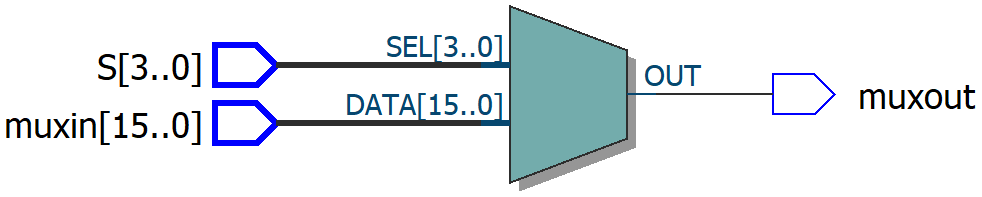

Main Circuit
====


# Operation and ModelSim


<div>
<table  style="text-align:center;">  
<tr> 
 <td><b>SELECT</b></td>  
<td><b>OPERATION</b></td>  
</tr>  
<tr>  
<td>0000</td>  
<td>AC + DR</td> 
 </tr> 
<tr>  
<td>0001</td>  
<td>AC - DR</td> 
</tr> 
<tr>  
<td>0010</td>  
<td>AC + DR + C</td> 
</tr> 
<tr>  
<td>0011</td>  
<td>AC + DR'</td> 
</tr> 
<tr>  
<td>0100</td>  
<td>DR</td> 
</tr> 
<tr>  
<td>0101</td>  
<td>DR + 1</td> 
</tr> 
<tr>  
<td>0110</td>  
<td>INP</td> 
</tr> 
<tr>  
<td>0111</td>  
<td>INP + 1</td> 
</tr> 
<tr>  
<td>1000</td>  
<td>AC + 1</td> 
</tr> 
<tr>  
<td>1001</td>  
<td>AC - 1</td> 
</tr> 
<tr>  
<td>1010</td>  
<td>DR - 1</td> 
</tr> 
<tr>  
<td>1011</td>  
<td>AC and DR</td> 
</tr> 
<tr>  
<td>1100</td>  
<td>AC or DR</td> 
</tr> 
<tr>  
<td>1101</td>  
<td>AC xor DR</td> 
</tr> 
<tr>  
<td>1110</td>  
<td>ror(AC)</td> 
</tr> 
<tr>  
<td>1111</td>  
<td>rol(AC)</td> 
</tr> 
</table>


# Ports


<table style="text-align:center;" align="right">
<tr>
<td>
<b>PORTS</b>
</td>
</tr>

<tr>
<td>
AC = Accumulator Register 16 Bit Data
</td>
</tr>

<tr>
<td>
DR = Data Register 16 Bit Data
</td>
</tr>

<tr>
<td>
INP = Input Register 16 Bit Data
</td>
</tr>

<tr>
<td>
sec = MUX Selection Input
</td>
</tr>

<tr>
<td>
C = Carry Input
</td>
</tr>

<tr>
<td>
Cout = Carry Output
</td>
</tr>

<tr>
<td>
Sonuc = Result
</td>
</tr>
</table>
</div>


```
port(
	AC : in std_logic_vector(15 downto 0);
	DR : in std_logic_vector(15 downto 0);
	INP : in std_logic_vector(15 downto 0);
	sec : in std_logic_vector(3 downto 0);
	C : in std_logic;
	
	Cout : out std_logic;
	Sonuc : out std_logic_vector(15 downto 0)
	);

```


# Multiplexer

## Port

```
port(
	S : in std_logic_vector(3 downto 0);
	muxin : in std_logic_vector(15 downto 0);
	
	muxout : out std_logic
	);

```

## RTL


<br/>


