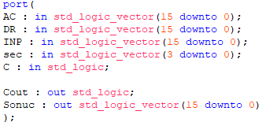

Main Circuit
====

|  AC = Accumulator Register 16 Bit Data |
|:---:|
|  DR = Data Register 16 Bit Data |
|  INP = Input Register 16 Bit Data |
|  sec = MUX Selection Input |
|  C = Carry Input|
|  Cout = Carry Output|
|  Sonuc = Result|

| SELECT | OPERATION |
|:--:|:--:|
| 0000  | AC + DR|
| 0001  | AC - DR|
| 0010  | AC + DR + C|
| 0011  | AC + DR'|
| 0100  | DR|
| 0101  | DR + 1|
| 0110  | INP|
| 0111  | INP + 1|
| 1000  | AC + 1|
| 1001  | AC - 1|
| 1010  | DR - 1|
| 1011  | AC and DR|
| 1100  | AC or DR|
| 1101  | AC xor DR|
| 1110  | ror(AC)|
| 1111  | rol(AC)|

